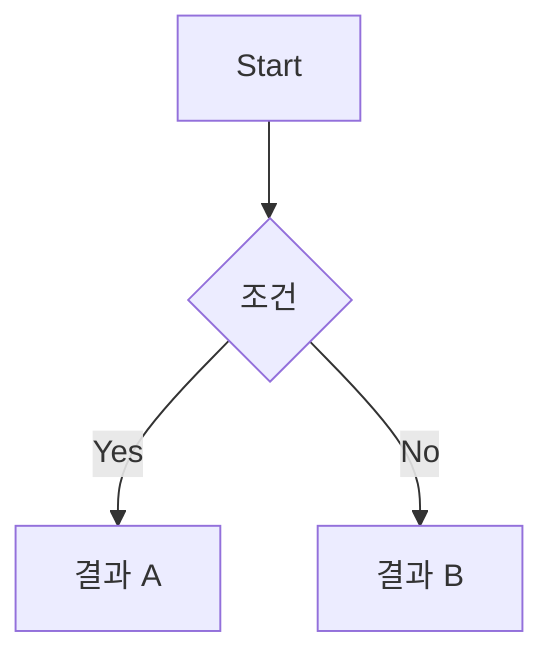

## Context

- 문제 배경, 기존 논의 요지, 제약사항, 우선순위 근거를 요약합니다.
- 외부 링크 대신 핵심 내용을 본문에 포함합니다.

## Goals / Non-Goals

**Goals (목표):**
- ...

**Non-Goals (비목표):**
- ...

## Success Definition

- 이 기능이 성공했다고 판단할 수 있는 기준을 정량적/정성적으로 정의합니다.

## Requirements

**Must-have (필수):** 3개 이하 권장
- [ ] ...

**Nice-to-have (선택):**
- [ ] ...

## UX Acceptance Criteria

- 핵심 상호작용과 기대 결과를 짧게 나열합니다.

## User Flows

- 핵심 사용자 시나리오를 Mermaid.js 순서도로 표현합니다.

## Wireframes

- 핵심 화면 레이아웃을 시각적으로 표현합니다.
- HTML 목업 파일 경로: `docs/mockups/{featureName}.html`
