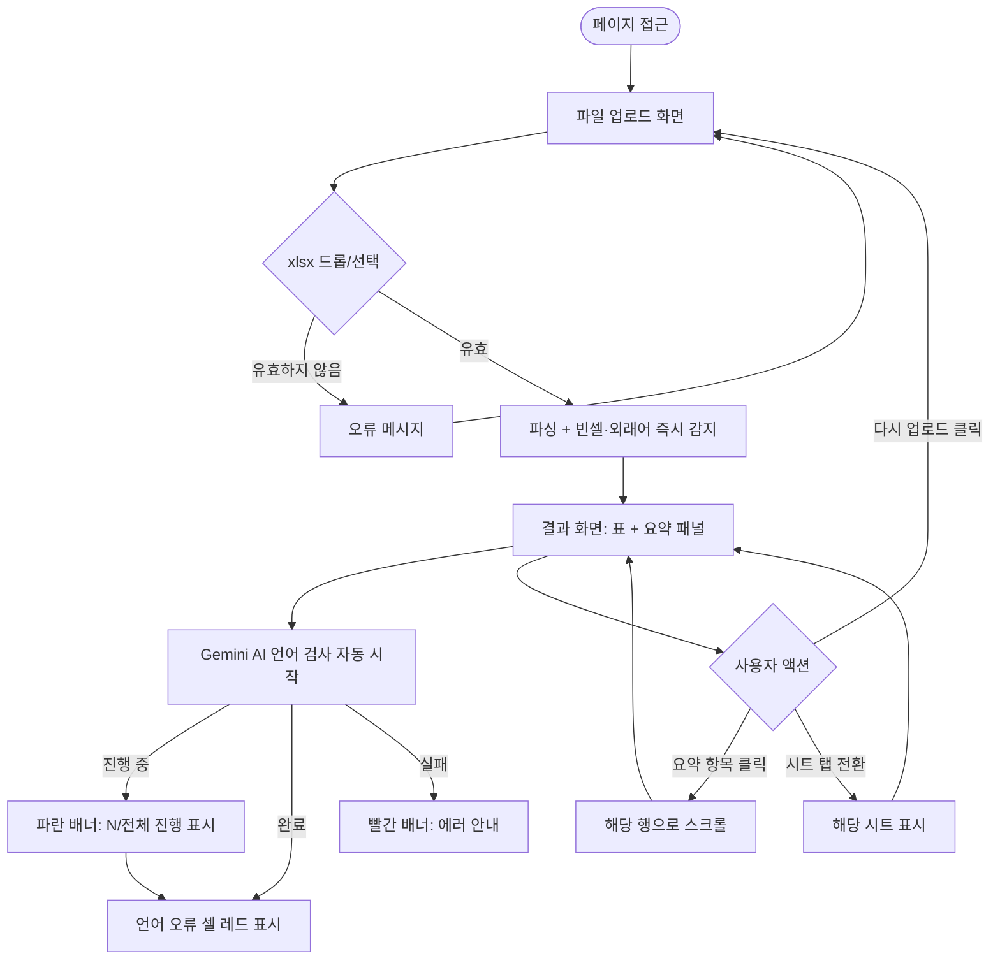

## Context

스토리타코 게임 개발팀은 다국어 스트링 파일(string.xlsx)을 관리한다. 이 파일에는 한국어를 포함한 10개 언어의 게임 텍스트가 컬럼별로 관리되며, 빈 셀·언어 오류·번역 누락 등의 문제를 현재 수동으로 확인하고 있다.

반복되는 수동 검수 업무를 자동화하여 실수를 줄인다. 파일을 업로드하면 빈 셀·공용 외래어는 즉시 감지하고, 언어 오류는 Gemini AI가 자동 검증하여 결과를 표로 표시한다.

**파일 구조 (고정):**
- 시트: `STRING_LOCAL`, `STRING_SERVER` 2개 시트로 구성
- 1~3행: 헤더/메타 영역 (데이터 아님)
- 4행~: 데이터 (A열: 인덱스, B열~K열: 언어별 스트링)
- B: 한국어 / C: 영어 / D: 프랑스어 / E: 일본어 / F: 스페인어 / G: 독일어 / H: 인도네시아어 / I: 베트남어 / J: 중국어(번체) / K: 러시아어

**제약사항:**
- 데이터를 서버에 저장하지 않음 (브라우저 내 처리만)
- 컬럼 구조는 위 고정 스펙 그대로 (변경 기능 불필요)
- Gemini API 키(`GEMINI_API_KEY`) 필요
- 컬럼이 11개(A~K)로 가로 스크롤 필수
- 두 언어에서 동일하게 사용 가능한 표현(예: 일어·중국어 공통 한자어)은 오류로 처리하지 않음

## Goals / Non-Goals

**Goals (목표):**
- xlsx 파일 업로드 → STRING_LOCAL / STRING_SERVER 시트를 탭으로 분리하여 표시
- 각 시트별 인덱스 + 10개 언어 컬럼 전체를 표 형태로 표시
- 수정 필요(레드) / 경고(옐로) 구분 표시, 두 카테고리를 별도 섹션(요약 패널)으로 표시
- 수정 필요 항목: 빈 셀, Gemini AI가 잘못된 언어로 판정한 셀
- 경고 항목: 공용 외래어로 추정되는 셀 (9개 비한국어 언어 중 4개 이상이 동일한 표현인 경우)
- 요약 패널에서 항목 클릭 시 해당 셀로 스크롤

**Non-Goals (비목표):**
- 서버 저장·히스토리 관리 없음
- 컬럼 구조 커스터마이징 없음 (언어 추가/제거 기능 없음)
- 실시간 공동 편집 없음
- 번역 기능 없음 — 검사·표시 전용. 오류 확인 후 원본 파일에서 직접 수정
- 인라인 편집 없음
- xlsx 다운로드 없음

## Success Definition

- string.xlsx 업로드 후 3초 내 STRING_LOCAL / STRING_SERVER 양 시트가 탭으로 렌더링됨 (시트당 1000행 이하 기준)
- 탭 전환 시 해당 시트의 오류/경고 요약과 데이터 표가 즉시 표시됨
- 빈 셀이 레드, 공용 외래어 추정 셀이 옐로로 자동 하이라이트됨
- 파일 업로드 완료 후 Gemini AI 언어 검사가 배치 단위로 자동 실행되어 언어 오류 셀이 레드로 표시됨
- 수정/경고 항목이 별도 섹션에 요약되어 빠르게 확인 가능

## Requirements

**Must-have (필수):**
- [x] **파일 업로드**: xlsx 파일을 드래그&드롭 또는 버튼으로 업로드. 4행~부터 데이터 파싱 (A=인덱스, B~K=10개 언어)
- [x] **스트링 표 렌더링**: 인덱스 + 10개 언어 컬럼 전체를 표 형태로 표시. 가로 스크롤 지원
- [x] **오류 감지 — 빈 셀**: 데이터 행에서 빈 셀은 레드로 하이라이트
- [x] **오류 감지 — 언어 오류**: Gemini AI가 각 셀의 텍스트가 해당 컬럼의 기대 언어와 다른 경우 레드로 하이라이트. 브랜드명·고유명사·게임 용어·공용 외래어는 오류로 처리 안 함. 배치 단위(40행) 처리
- [x] **경고 감지 — 공용 외래어**: 9개 비한국어 언어 중 4개 이상이 동일 표현이면 옐로 경고로 분류
- [x] **수정/경고 요약 패널**: 수정 필요 항목(레드)과 경고 항목(옐로)을 각각 별도 리스트로 표시. 항목 클릭 시 표에서 해당 셀로 스크롤
- [x] **AI 검사 진행 배너**: Gemini API 호출 중 진행 상태(완료 행/전체 행) 표시
- [x] **AI 검사 오류 처리**: Gemini API 실패 시 배너에 에러 표시 (빈 셀·외래어 감지 결과는 유지)

**Nice-to-have (선택):**
- [ ] **오류 행 필터**: 수정 필요 또는 경고가 있는 행만 표시하는 필터 토글
- [ ] **번역 기능**: 한국어만 있는 행에 번역 결과 자동 채우기
- [ ] **인라인 편집**: 셀 클릭으로 내용 수정 후 xlsx 다운로드

## UX Acceptance Criteria

**업로드 화면**
- 페이지 접근 시 파일 업로드 영역이 중앙에 표시됨
- xlsx 파일을 드래그&드롭하거나 클릭하여 파일 선택 가능
- xlsx 외 파일 업로드 시 "xlsx 파일만 지원합니다" 오류 메시지 표시
- 유효한 파일 업로드 시 즉시 파싱 → 결과 화면으로 전환, AI 언어 검사 자동 시작

**결과 화면 — 상단 헤더 바**
- 현재 파일명 + 시트 수 + 총 행 수 표시
- `[다시 업로드]` 버튼: 업로드 화면으로 돌아가기

**결과 화면 — 시트 탭**
- STRING_LOCAL / STRING_SERVER 탭으로 분리, 각 탭에 오류 수 뱃지 표시
- 탭 클릭 시 해당 시트의 요약 패널과 표로 즉시 전환

**결과 화면 — AI 검사 진행 배너**
- Gemini API 호출 중: 파란 배너 + 스피너 + "AI 언어 검사 중... (N/전체행)" 표시
- 검사 실패 시: 빨간 배너 + 에러 메시지 + "빈 셀·외래어 검사만 표시됩니다" 안내

**결과 화면 — 요약 패널**
- 🔴 수정 필요 N건 / 🟡 경고 N건을 그룹으로 표시
- 각 항목 클릭 시 표의 해당 행으로 스크롤

**결과 화면 — 스트링 표**
- 인덱스(A) + 10개 언어 컬럼(B~K) 표시, 가로 스크롤 지원
- 컬럼 헤더에 컬럼 문자(B~K) + 언어명 표시
- 빈 셀: 레드 링 테두리
- 언어 오류 셀: 레드 배경 + 툴팁으로 "언어 오류 (감지: OO)"
- 공용 외래어 셀: 옐로 배경 + 툴팁으로 "공용 외래어 추정 (N/9개 언어 동일)"
- 표는 읽기 전용 (편집 불가)

## User Flows

## Wireframes

- HTML 목업 파일 경로: `docs/mockups/string-check.html`
