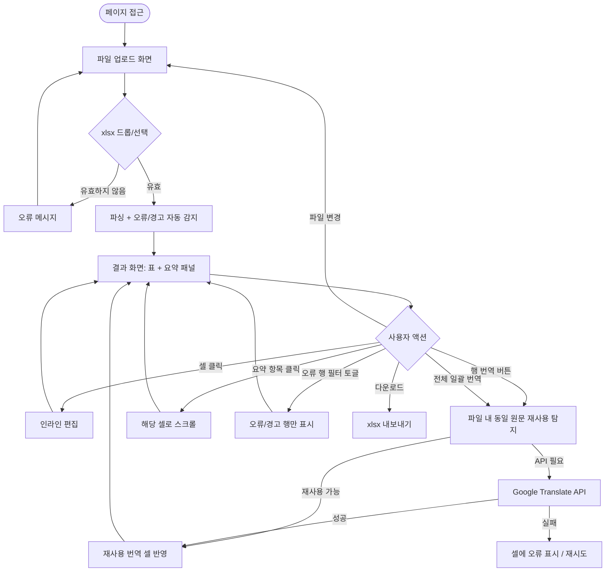

## Context

스토리타코 게임 개발팀은 다국어 스트링 파일(string.xlsx)을 관리한다. 이 파일에는 한국어를 포함한 10개 언어의 게임 텍스트가 컬럼별로 관리되며, 빈 셀·언어 오류·번역 누락 등의 문제를 현재 수동으로 확인하고 있다.

반복되는 수동 검수 업무를 자동화하여 실수를 줄이고, 한국어 원문만 입력된 셀은 Google Translate API로 즉시 번역 초안을 채워 작업 속도를 높인다.

**파일 구조 (고정):**
- 1~3행: 헤더/메타 영역 (데이터 아님)
- 4행~: 데이터 (A열: 인덱스, B열~K열: 언어별 스트링)
- B: 한국어 / C: 영어 / D: 프랑스어 / E: 일본어 / F: 스페인어 / G: 독일어 / H: 인도네시아어 / I: 베트남어 / J: 중국어(번체) / K: 러시아어

**제약사항:**
- 데이터를 서버에 저장하지 않음 (브라우저 내 처리만)
- 컬럼 구조는 위 고정 스펙 그대로 (변경 기능 불필요)
- Google Translate API 키 신규 발급 필요
- 컬럼이 11개(A~K)로 가로 스크롤 필수
- 언어 감지는 통계 기반 라이브러리(tinyld) 사용 — 실제 언어 표현의 적합성을 판별
- 두 언어에서 동일하게 사용 가능한 표현(예: 일어·중국어 공통 한자어)은 오류로 처리하지 않음

## Goals / Non-Goals

**Goals (목표):**
- xlsx 파일 업로드 → 인덱스 + 10개 언어 컬럼 전체를 표 형태로 표시
- 수정 필요(레드) / 경고(옐로) 구분 표시, 두 카테고리를 별도 섹션으로 표시
- 수정 필요 항목: 빈 셀, 해당 컬럼과 다른 언어가 입력된 셀
- 경고 항목: 공용 외래어로 추정되는 셀 (대다수 언어 컬럼에서 동일한 표현을 사용하는 경우)
- 한국어(B열)만 입력되고 다른 언어 컬럼이 비어있는 경우 → Google Translate로 번역 자동 입력 (행 단위 개별 번역 + 전체 일괄 번역 모두 지원)
- 번역 시 동일 한국어 원문이 파일 내 다른 행에 이미 번역되어 있으면 해당 번역을 재사용 (API 호출 없이 즉시 채움, 번역 일관성 보장)
- 번역/수정이 반영된 데이터를 xlsx 파일로 다운로드

**Non-Goals (비목표):**
- 서버 저장·히스토리 관리 없음
- 컬럼 구조 커스터마이징 없음 (언어 추가/제거 기능 없음)
- 실시간 공동 편집 없음
- 번역 품질 검수 자동화 없음 (번역 초안 제공만)

## Success Definition

- string.xlsx 업로드 후 3초 내 전체 스트링 표가 렌더링됨 (1000행 이하 기준)
- 빈 셀이 레드, 공용 외래어 추정 셀이 옐로로 자동 하이라이트됨
- 수정/경고 항목이 별도 섹션에 요약되어 빠르게 확인 가능
- 한국어만 있는 행의 번역 버튼 클릭 시 Google Translate로 나머지 언어 컬럼이 채워짐
- 번역이 반영된 xlsx를 다운로드할 수 있음

## Requirements

**Must-have (필수):**
- [ ] **파일 업로드**: xlsx 파일을 드래그&드롭 또는 버튼으로 업로드. 4행~부터 데이터 파싱 (A=인덱스, B~K=10개 언어)
- [ ] **스트링 표 렌더링**: 인덱스 + 10개 언어 컬럼 전체를 표 형태로 표시. 가로 스크롤 지원
- [ ] **오류 감지 — 빈 셀**: 데이터 행에서 빈 셀은 레드로 하이라이트
- [ ] **오류 감지 — 언어 오류**: 각 컬럼의 기대 언어와 다른 언어가 입력된 셀은 레드로 하이라이트. `tinyld` 라이브러리로 언어 판별, 두 언어 공통 표현은 오류 처리 안 함
- [ ] **경고 감지 — 공용 외래어**: 해당 셀 값이 대다수(6/9개 이상) 다른 언어 컬럼과 동일한 표현이면 옐로 경고로 분류
- [ ] **수정/경고 요약 패널**: 수정 필요 항목(레드)과 경고 항목(옐로)을 각각 별도 리스트로 표시. 항목 클릭 시 표에서 해당 셀로 스크롤
- [ ] **번역 자동 입력**: 한국어(B열)만 입력되고 해당 행의 다른 언어 컬럼이 비어있는 경우 — 행 단위 번역 버튼 + 전체 일괄 번역 버튼 제공
  - 번역 전 파일 내 동일 한국어 원문 행을 먼저 탐색하여 이미 번역된 값을 재사용 (API 호출 없이 즉시 채움)
  - 재사용으로 채울 수 없는 언어만 Google Translate API 호출
- [ ] **번역 결과 인라인 편집**: 번역된 셀(및 모든 셀)을 표에서 직접 수정 가능
- [ ] **오류 행 필터**: 수정 필요 또는 경고가 있는 행만 표시하는 필터 토글
- [ ] **API 오류 처리**: 번역 API 호출 실패 시 해당 셀에 오류 상태 표시, 재시도 가능
- [ ] **xlsx 다운로드**: 현재 표 상태(번역/수정 반영)를 원본 형식 그대로 xlsx로 내보내기

**Nice-to-have (선택):**
- [ ] **번역 진행 상태 표시**: 일괄 번역 중 진행률 표시 (몇 행 / 전체 번역 대상 행)
- [ ] **언어 감지 신뢰도 표시**: 언어 판별 신뢰도가 낮은 셀에 별도 아이콘으로 표시

## UX Acceptance Criteria

**업로드 화면**
- 페이지 접근 시 파일 업로드 영역이 중앙에 표시됨
- xlsx 파일을 드래그&드롭하거나 클릭하여 파일 선택 가능
- xlsx 외 파일 업로드 시 "xlsx 파일만 지원합니다" 오류 메시지 표시
- 유효한 파일 업로드 시 즉시 파싱 → 결과 화면으로 전환

**결과 화면 — 상단 액션 바**
- 현재 파일명 표시
- `[오류 행만]` 토글 버튼: 수정/경고가 있는 행만 필터링
- `[전체 번역]` 버튼: 한국어만 있는 모든 행을 일괄 번역
- `[다운로드]` 버튼: 현재 상태를 xlsx로 저장
- `[파일 변경]` 버튼: 업로드 화면으로 돌아가기

**결과 화면 — 요약 패널**
- 🔴 수정 필요 N건 / 🟡 경고 N건을 카드 형태로 표시
- 각 항목 클릭 시 표의 해당 셀로 스크롤 및 포커스

**결과 화면 — 스트링 표**
- 인덱스(A) + 10개 언어 컬럼(B~K) 표시, 가로 스크롤 지원
- 컬럼 헤더에 언어명 표시 (한국어, 영어, 프랑스어 …)
- 빈 셀: 레드 배경
- 언어 오류 셀: 레드 배경 + 툴팁으로 "감지된 언어: OO"
- 공용 외래어 셀: 옐로 배경 + 툴팁으로 "공용 외래어로 추정됨"
- 번역 대상 행(한국어만 있는 행): 행 우측에 `[번역]` 버튼 표시
- 셀 클릭 시 인라인 편집 모드 전환 (입력 후 Enter 또는 바깥 클릭으로 확정)

**번역**
- 행 번역 버튼 클릭 시 해당 행의 빈 외국어 셀에만 번역 결과 채움 (파일 내 동일 원문 재사용 후, 남은 언어만 API 호출)
- 전체 일괄 번역 클릭 시 재사용 제외 후 실제 API 호출 예정 문자 수를 표시하고 사용자 확인 후 순차 처리
- API 오류 시 해당 셀에 오렌지 테두리 + "번역 실패" 표시 → 셀 클릭으로 재시도

## User Flows

## Wireframes

- HTML 목업 파일 경로: `docs/mockups/string-check.html`
