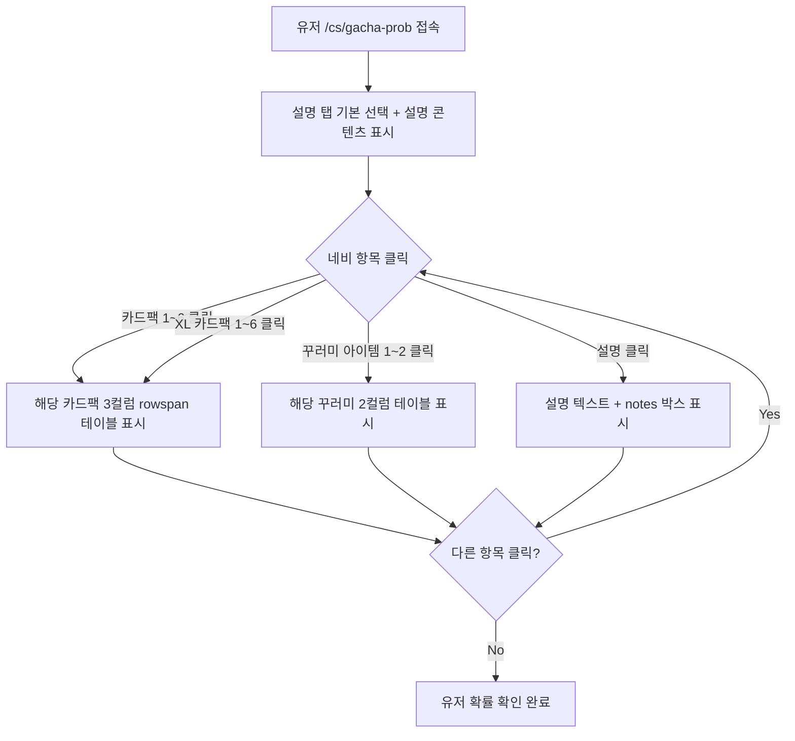

## Context

- Notion "반복 작업 작업대 기획" 문서에 CS 페이지 군(group) 중 하나로 명시된 기능.
- 모바일 게임 규정(대한민국 게임법, 앱스토어/구글플레이 정책)상 확률형 아이템(가챠)의 확률은 반드시 유저에게 공개해야 한다. **이 페이지가 없으면 스토어 심사 거절 사유가 될 수 있다.**
- 현재 CS 사이트(`/cs`)는 고객 안내·FAQ·문의 페이지를 갖추고 있으나 확률 공지 페이지가 없다.
- 제약사항: 초기에는 코드 내 정적 더미 데이터로 관리하며, 항목 수 변경은 개발자가 직접 파일을 수정해야 한다.
- 참고 레퍼런스: `cdn.mergecola.com/page/cola_cards.html` (좌측 카테고리 네비 + 우측 테이블 구조)
- 데이터는 초기에 정적 더미로 시작하며 추후 운영자가 직접 파일을 수정해 관리한다. (Supabase 연동 없음)
- 대상 페이지 목록: 설명(1) + 카드팩(6) + XL 카드팩(6) + 꾸러미 아이템(2) = 총 15개

## Goals / Non-Goals

**Goals (목표):**
- 유저가 `/cs/gacha-prob` 에 접속해 카드팩·XL 카드팩·꾸러미 아이템 각각의 확률표를 확인할 수 있다.
- 기존 CS 레이아웃(CsHeader + CsFooter)을 그대로 재사용하여 디자인 일관성을 유지한다.
- 좌측 카테고리 네비게이션에서 항목을 클릭하면 우측 콘텐츠가 교체되는 SPA 방식으로 동작한다.
- 다크모드 및 반응형(모바일 포함) 지원.

**Non-Goals (비목표):**
- Supabase 연동 및 CMS 방식의 데이터 관리 (추후 과제).
- 어드민에서 확률 데이터를 수정하는 기능.
- 다국어(i18n) 지원 (현재 CS 전반에 걸쳐 미구현).
- 실제 게임 데이터와의 동기화.

## Success Definition

- **정량:** `/cs/gacha-prob` 페이지가 빌드 오류 없이 정상 렌더링된다.
- **정량:** 15개 카테고리 항목이 네비게이션에 표시되며, 클릭 시 해당 콘텐츠로 전환된다.
- **정성:** 유저가 원하는 카드팩의 확률을 3회 이내 클릭으로 확인할 수 있다.
- **정성:** 모바일(max-width 450px) 환경에서 레이아웃이 깨지지 않는다.
- **정성:** 다크모드 전환 시 텍스트·테이블·네비게이션 모두 배경과 충분한 명도 대비를 유지한다 (흰 배경 텍스트가 어두운 배경에서 읽히지 않는 상황 없음).

## Requirements

**Must-have (필수):**
- [x] **네비게이션 구성:** 좌측 네비에 설명(1)·카드팩(6)·XL카드팩(6)·꾸러미(2) 총 15개 항목이 표시되며, 그룹 사이에 `
` 구분선이 있다. 각 항목은 이모지 아이콘 + 이름으로 구성된다.
- [x] **선택 상태 강조:** 현재 선택된 항목은 파란색 배경(`bg-blue-100`)으로 강조되고, 나머지 항목은 호버 시 에메랄드색(`hover:bg-emerald-100`) 피드백을 제공한다. 기본 선택은 "설명" 항목.
- [x] **카드팩 확률 테이블:** 카드팩·XL카드팩 선택 시 희귀도(20%)·카드명(65%)·확률(15%) 3컬럼 테이블이 표시된다. 동일 희귀도 그룹의 희귀도 셀과 확률 셀은 `rowSpan`으로 병합된다. 희귀도는 별(★) 기호로 표현된다.
- [x] **꾸러미 확률 테이블:** 꾸러미 선택 시 아이템명·확률 2컬럼 테이블이 표시된다.
- [x] **데이터 구조:** 각 항목은 `PackConfig` 타입으로 정의되며 `id·name·icon·type·groups?·items?·notes?·description?` 필드를 갖는다. 카드팩은 `RankGroup[]`(희귀도 그룹) → `CardEntry[]`(개별 카드) 중첩 구조.

**Nice-to-have (선택):**
- [x] 설명 페이지에 주의사항 노트(`notes`) 블록이 회색 배경 박스로 시각적으로 구분되어 표시된다.
- [x] 카드팩 페이지 하단에 해당 팩의 개별 `notes` 문구를 표시할 수 있다.
- [x] 반응형: `max-width 450px` 이하에서 네비 22% / 콘텐츠 78% 비율 유지, 폰트·패딩 축소.
- [x] 다크모드: 네비·테이블·배경 모두 `dark:` variant 적용.
- [ ] 선택된 카테고리를 URL 해시(`#pack-1` 등)로 북마크·공유 가능. (**미구현, 추후 검토**)
- [ ] 빈 상태(empty state): `groups` 또는 `items` 배열이 비어있을 때 안내 메시지 표시. (**미구현, 추후 검토**)

## UX Acceptance Criteria

**네비게이션:**
- 페이지 첫 진입 시 기본 선택 항목은 "설명"이며, 파란색 배경으로 강조된다.
- 네비 항목 클릭 시 페이지 이동 없이 우측 콘텐츠만 교체된다 (SPA 방식).
- 항목 호버 시 에메랄드색 배경 전환, 선택된 항목 호버는 그대로 파란색 유지.
- 그룹(설명 / 카드팩 / XL카드팩 / 꾸러미) 사이에 구분선이 표시된다.

**콘텐츠 — 설명 타입:**
- 본문 텍스트와 주의사항(notes)이 분리된 회색 박스로 표시된다.
- notes는 줄바꿈(`\n`)으로 구분되어 각 줄이 개별 단락으로 렌더링된다.

**콘텐츠 — 카드팩 타입:**
- 테이블 헤더: 희귀도 / 카드 / 확률 순서.
- 동일 희귀도 그룹의 첫 번째 행에만 희귀도·확률 셀이 렌더링되고, 나머지 행은 그 셀을 `rowSpan`으로 차지한다.
- 희귀도 셀은 황금색(`text-yellow-600`) 텍스트로 시각적으로 구분된다.
- notes가 있으면 테이블 하단에 작은 회색 텍스트로 표시된다.
- 행 호버 시 연한 회색 배경.

**콘텐츠 — 꾸러미 타입:**
- 테이블 헤더: 아이템 명칭 / 확률.
- 행 호버 시 연한 회색 배경.

**반응형 (≤ 450px):**
- 네비 22% / 콘텐츠 78% 비율 유지.
- 테이블은 `overflow-x-auto`로 가로 스크롤 처리.
- 폰트·패딩이 축소되어 작은 화면에서도 읽기 가능.

**다크모드:**
- 네비 배경: `bg-gray-800`, 콘텐츠 배경: `bg-gray-950`.
- 테이블 테두리, 헤더 배경, 텍스트 색상 모두 다크모드 variant 적용.

## User Flows

## Wireframes

- HTML 목업 파일 경로: `docs/mockups/gacha-prob.html`
